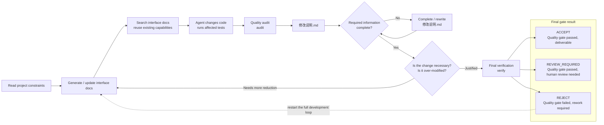

<div align="center">

# Repository Quality Guard

### A standardized high-quality development and audit workflow for Coding Agents

**Stop Agents from hiding surprises inside thousands of lines of `git diff`.**

RQG does more than inspect code after an Agent writes it. It uses executable rules to constrain **how an Agent should complete a high-quality code change and deliver it**: understand the existing project first, search for reusable capabilities before adding new ones, explain why each change is necessary, test real behavior rather than implementation shape, and produce evidence that can be independently checked again later.

Think of it as **a set of development rules, quality checks, and Git delivery gates installed for your Coding Agent.**

**Code quality fails → produce a detailed quality report → the Agent reworks the code using that report → audit again → verify again.**

This is not a checklist or a style guide. It is an **enforced high-quality delivery workflow**.

[](https://github.com/shijunfeng00/repository-quality-guard/tags)
[](references/RULES.md)


**English** · [简体中文](README_zh.md) · [Complete QG rules](references/RULES.md) · [Project customization](#project-customization-make-rqg-fit-your-repository) · [Version tags](https://github.com/shijunfeng00/repository-quality-guard/tags)

</div>

---

## Contents

- [Repository Quality Guard in one sentence](#repository-quality-guard-in-one-sentence)
- [Language support](#language-support)
- [Why Repository Quality Guard exists](#why-repository-quality-guard-exists)
- [What Repository Quality Guard changes](#what-repository-quality-guard-changes)
- [Redefining how humans and Agents collaborate](#redefining-how-humans-and-agents-collaborate)
- [Quick start](#quick-start)
- [How RQG protects the quality of Agent-written code](#how-rqg-protects-the-quality-of-agent-written-code)
- [`修改说明.md`: the delivery answer sheet an Agent cannot skip](#修改说明md-the-delivery-answer-sheet-an-agent-cannot-skip)
- [Quality check failed? Rework from the report](#quality-check-failed-rework-from-the-report)
- [Project customization: make RQG fit your repository](#project-customization-make-rqg-fit-your-repository)
- [License](#license)

---

# Repository Quality Guard in one sentence

**Stop Agents from hiding surprises inside thousands of lines of `git diff`.** RQG does not merely inspect Agent-written code. It constrains **how an Agent must complete a high-quality code change and delivery**: when quality checks fail, RQG produces a detailed problem report, the Agent reworks the code from that report, and the result is audited, explained, and verified again.

**It is not advice, a checklist, or a style guide. It is an enforced delivery workflow an Agent cannot pass simply by saying “done.”**

> **Do not trust an Agent merely because it says the task is complete. Make it bring evidence to the gate.**

RQG is also not a fixed rule set that every project must use unchanged. You can decide which findings should block delivery, which paths need stricter treatment, where explicit exceptions are allowed, and which project-specific checks should exist—without modifying the RQG Core. See **[Project customization](#project-customization-make-rqg-fit-your-repository)**.

---

# Language support

RQG currently supports **Python, JavaScript, TypeScript, CSS, HTML, and C/C++**. Analysis depth varies by language, with Python receiving the deepest coverage.

| Language | What RQG can currently check |
| --- | --- |
| **Python** | Deepest support: functions, classes, inheritance, interface changes, call relationships, affected tests, and project-specific extensions |
| **JavaScript / TypeScript** | Code structure, complexity, duplicate definitions, and parts of call/ownership analysis |
| **CSS** | Syntax and structural issues such as duplicate declaration blocks |
| **HTML** | Basic structural problems such as duplicate `id` values |
| **C / C++** | Uses Clang to analyze changed functions, branches, nesting, and complexity deltas |

Even in mixed-language repositories, RQG can still manage the overall change scope, `修改说明.md`, project policy, and the final Git delivery gate. If a required parser is missing, RQG does not silently degrade and pretend the change passed.

---

## Why Repository Quality Guard exists

Coding Agents can already modify dozens of files, hundreds of functions, and thousands of lines in minutes. The hard question is no longer simply “can the Agent write code?” It is: **why did these thousands of lines need to change, which changes were actually necessary, did the Agent duplicate existing capabilities, break interfaces or inheritance, hide bugs behind fallbacks, rewrite tests to match the implementation, create new technical debt, and what evidence proves this code deserves to be merged?**

Repository Quality Guard grew out of **more than a year of real Agent-development failures and cleanup work**. If you have used Coding Agents in a long-lived repository, some of these situations may look familiar.

### 1. A small request becomes a giant `git diff`

The task asks for one local change. The Agent also reformats code, adds parameters and propagates them through several layers, creates helpers and wrappers, adds state, compatibility branches, and fallbacks. A small requirement becomes **1000+ changed lines across 20+ files with double-digit new interfaces**. Each individual change may sound defensible, while the combined patch is far larger than the requirement.

Agents are very good at adding code. In mature repositories, the harder problem is often **stopping them from changing things that did not need to change**. As Agents get faster and produce larger patches, manual review can consume the time saved by generation. Skip the review, and a repository can turn into a maintenance nightmare after only a few rounds.

### 2. Existing capabilities get built again

A base class already provides a shared capability, but an Agent ignores or even removes it and reimplements similar logic in several subclasses. A public method already exists, but the new change bypasses it and spreads the same responsibility across helpers, subclasses, and call paths.

The new code may run and local tests may pass, yet the repository has already gained duplicate implementations, drifting ownership, and new cross-layer coupling. The next Agent then modifies those duplicates and creates more. The result is simple: **more code, less clear ownership, and a codebase fewer people are willing to touch.**

### 3. The BUG is not fixed; a fallback hides it

The correct fix may be to remove broken logic, unify a data contract, or let an invalid state fail loudly. Instead, the Agent adds more `if/else`, `isinstance`, `hasattr`, defaults, helpers, legacy compatibility branches, and fallbacks. Broken old behavior stays in place; when the new path fails, execution quietly falls back to the old one. No path is allowed to become the single correct implementation, so two or three versions of the same logic live forever.

Add a broad `Exception` handler that silently discards the failure—what we call **`try-except-pass`**—and the real bug has not disappeared. It has become harder to find. The code may look “more compatible” or “more robust,” while in reality it contains more error paths, more duplicated logic, swallowed failures, and no clear answer to **which path is actually correct**.

### 4. Tests stop validating behavior and permanently freeze the wrong implementation

An Agent adds unit tests, regression tests, and smoke tests while changing code. The test count increases and coverage looks better, but many tests do not verify whether the feature works. They merely guarantee that:

**the current diff must never change shape again.**

Delete a function and the Agent writes `assert not hasattr(module, "old_function")`. Migrate an implementation and it hardcodes the old procedure ID, class name, interface name, module path, or exact call shape into an assertion. Change a DSL, config, or natural-language report and it may even use a **regular expression to require some keyword to exist forever**. An implementation detail becomes a “test contract” that future code must preserve.

Worse, when production code changes and old tests fail, the Agent may not question the implementation first. It may remove important assertions, change expected values, skip failures, or generate new tests that prove the current implementation is “correct.” Even when you explicitly ask to remove a bad implementation, old tests can convince the Agent that **whatever currently passes must be the correct architecture**.

Later, when you finally try to perform the refactor the repository actually needs, dozens or hundreds of tests push back: the old function must remain, the old class name cannot change, the old call path must survive, the old procedure must keep its shape, this helper must stay here, and even these source-code keywords must continue to exist exactly as they did yesterday.

**The wrong implementation has been welded into the repository by its tests.**

Over time, real bugs become increasingly difficult to remove. Even if you say “delete this function completely,” the Agent may refuse because of legacy tests and compatibility paths, or move the code into `/history`, a legacy branch, or another compatibility path so it still exists under a different name. Months later, another Agent searching for “existing capabilities” may pull the dead code back out of the trash and reuse it.

The most dangerous failure is not that an Agent can be wrong. It is that the Agent can build a closed loop that “proves” the wrong answer:

```text
Agent makes an assumption
        ↓
Agent changes the implementation
        ↓
Agent writes / changes the tests
        ↓
All tests pass
        ↓
Agent declares the change verified
```

That leaves one core question:

**Who verifies that the Agent actually followed your rules? Another Agent? Then who guarantees that second Agent followed them either?**

---

**An Agent cannot merely say “done.” It must provide evidence that can be checked again.**

---

## What Repository Quality Guard changes

You do not need another longer coding guideline for Agents. You need a **development workflow the Agent cannot pass by talking its way around it**. RQG turns “look for existing capabilities first, then change code, inspect the result, explain why the change is necessary, and finally verify the latest state” into a required delivery loop. If the code has quality problems, the Agent reworks it from the report. If `修改说明.md` is incomplete, the process cannot continue. If the patch is clearly larger than necessary, the Agent must reduce and tighten it. A formal result is produced only when the **latest code, latest report, and latest audit evidence** all pass final `verify`.

### A complete high-quality development loop



There are two different loops here. **If required report fields are missing, the Agent rewrites only `修改说明.md`; it cannot pretend the report is complete. If the code itself must change, or the final result is `REJECT`, the workflow goes back to interface documentation and existing-capability search before implementation continues.** That means rework still checks whether the Agent has introduced duplicate interfaces, put a responsibility under the wrong owner, added another fallback, or propagated a local parameter through too many layers.

`audit` is the quality-scanning stage. It creates or refreshes `修改说明.md`. `verify` is the final step and is read-only: it checks the latest state rather than modifying code for the Agent. An incomplete report cannot be treated as a final quality result. After final `verify`, any further change to source, configuration, interface indexes, or the report invalidates the previous result and requires the loop to run again.

---

# Redefining how humans and Agents collaborate

RQG is not “another Agent that reviews the first Agent.” It separates the work into three parts: **the Agent writes and explains, RQG uses deterministic mechanisms that do not depend on the Agent's self-evaluation to inspect and block, and humans decide only the things a machine should not decide for them.**

| Role | Primary responsibility |
| --- | --- |
| **RQG** | Uses deterministic rules to establish what actually changed: code, interfaces, inheritance, call relationships, tests, before/after deltas, and report completeness—and decides whether the change may enter delivery |
| **Agent** | Understands the requirement, searches for existing capabilities first, changes code, fixes quality findings, explains why the change is necessary, and completes `修改说明.md` |
| **Human** | Defines the real requirement and handles only `REVIEW_REQUIRED` decisions that genuinely need human authority, such as accepting compatibility breaks or important design changes |

`修改说明.md` is the handoff surface between the three. **RQG writes facts that can be checked by code; the Agent must read those facts and explain or justify them item by item; final `verify` checks the report against the latest source and evidence.** The Agent cannot turn a `REJECT` into a pass by writing “I think this is acceptable,” and a human does not have to start every review by excavating thousands of lines of `git diff`.

> **The Agent executes, explains, and provides evidence. RQG constrains, verifies, and blocks. Humans decide only what genuinely requires human judgment.**

---

# Quick start

RQG is installed as an Agent Skill. In simple terms, a Skill is **a set of executable working rules and tools installed for a Coding Agent**. After installation, you should not need to manually run a long sequence of audit commands for every task. The Agent is expected to follow the workflow itself: update interface documentation, search for existing capabilities, audit changes, fix issues, complete `修改说明.md`, and run final verification.

```bash
# 1. Install Repository Quality Guard
npx skills add shijunfeng00/repository-quality-guard

# 2. Install runtime dependencies
python .agents/skills/repository-quality-guard/runtime/install_dependencies.py

# 3. Install the Git delivery quality gate
python .agents/skills/repository-quality-guard/scripts/git_hook_install.py .
```

RQG exposes these stable workflow operations to the Agent:

```text
doc-generate   Turn existing functions / classes / interfaces into searchable documentation
doc-search     Search those docs for existing interfaces, similar capabilities, and the real owner of a responsibility
audit          Scan the current change, find quality problems, and maintain 修改说明.md
verify         Re-check the latest code, report, and evidence and produce the final gate result
```

Normal users usually do not need to run these commands one by one. They are the standard workflow the Agent should perform while completing a development task.

Want the complete rule reference first? Read **[`references/RULES.md`](references/RULES.md)**.

---

# How RQG protects the quality of Agent-written code

RQG does not guarantee quality by saying “please review the code carefully.” It combines several mechanisms: **establish what actually changed, use deterministic rules to find problems, require the Agent to explain why the change is justified, produce a structured report, and enforce another gate at Git delivery time.** Together they answer two questions: **what exactly did the Agent change, and why does that change deserve to remain?**

| Mechanism / artifact | What it actually does | Main problem it prevents |
| --- | --- | --- |
| **Interface documentation and existing-capability search** | Before adding a function, class, or interface, the Agent first checks whether the repository already has something it can reuse or extend | Rebuilding the same capability and creating multiple competing implementations |
| **QG quality rules** | Hundreds of stable numbered rules inspect code structure, exception handling, interface changes, tests, and change scope | Meaningless helper/wrapper layers, swallowed exceptions, fallback accumulation, and increasing complexity |
| **Before/after relationship analysis** | Compares which interfaces, call paths, inheritance relationships, and tests are affected by the change | Parameters propagated through many layers, ownership drift, and tiny requests that unexpectedly affect half the repository |
| **Test quality audit** | Detects weakened assertions, skipped failures, source-shape assertions, or keyword-based snapshots | Tests that adapt to the current diff and permanently freeze the wrong implementation |
| **`修改说明.md`** | Writes change facts automatically, then requires the Agent to explain necessity, reuse decisions, and verification evidence | Replacing evidence with “done, tests pass” |
| **Change-necessity review** | Asks once more before delivery: did we change too much, and can anything be deleted, merged, or reused? | Small requests expanding into giant diffs, over-design, and unnecessary compatibility code |
| **Final `verify`** | Recomputes the final state from the latest code, latest report, and latest evidence; later changes immediately invalidate the old result | Reusing stale reports or stale test results to claim current code already passed |
| **Git delivery gate** | Protects RQG's own quality infrastructure from opportunistic edits and re-checks the repository before `git push` | Letting the Agent change “the referee” or bypass a `REJECT` during normal delivery |

**QG is not an AI “vibe score.”** Each QG has a stable identifier and represents a programmatically checkable quality fact or delivery condition. For example:

| Example | What it focuses on |
| --- | --- |
| `QG001` | Thin helper functions, unnecessary wrappers, and similar code smells |
| `QG170–QG175` | Deleted tests, reduced assertions, skip / xfail, or new tests with no meaningful assertion |
| `QG192–QG194` | Production code changed without meaningful behavioral verification, or tests coupled too tightly to implementation details |
| `QG980–QG985` | Whether `修改说明.md` is complete, whether the Agent's explanation matches the facts, and whether final verification is valid |
| `QG990` | Whether RQG's own rules, configuration, or protected files were modified unexpectedly |

All of these checks end in only three formal states: **`ACCEPT`** = the quality gate passed and the change can be delivered; **`REVIEW_REQUIRED`** = the quality gate passed, but an important change still requires a human decision; **`REJECT`** = the current code is not acceptable and the Agent must continue modifying it.

The complete QG definitions live in **[`references/RULES.md`](references/RULES.md)**.

---

# `修改说明.md`: the delivery answer sheet an Agent cannot skip

`修改说明.md` is one of RQG's core delivery artifacts. It is not a normal “what I changed” status note. It is a **mandatory audit answer sheet**. RQG first writes facts such as which files, interfaces, call relationships, and tests changed and which QG findings were produced. The Agent must then answer the semantic question: “why was this change necessary?” Finally, `verify` checks whether the report is complete and still matches the current code.

At minimum, it should answer:

- Which files, interfaces, classes, functions, call relationships, and tests changed?
- Before adding a new capability, did the Agent search for an existing implementation? Why could it not reuse or extend one?
- Why were new interfaces, parameters, state, helper functions, or fallbacks necessary?
- Did any public interface change? Did base/subclass responsibilities move? Is a capability owned by the wrong component?
- Do test changes protect real behavior, or just preserve the current diff?
- After the change-necessity review, what was deleted, merged, reused, or tightened?
- What real verification was run, and which remaining risks still need human confirmation?

Many changes look “finished” once the code runs and tests are green. But forcing the Agent to answer these questions often exposes duplicate implementations, interface sprawl, fallback accumulation, and tests that merely mirror the implementation. **If the report cannot explain the change coherently, the correct action is not to make the report sound better. It is to go back and fix the code.**

A simplified report looks roughly like this:

```markdown
# 修改说明

## Change facts
- Changed files / interfaces / callers / tests
- QG findings introduced or worsened in this change

## Key changes
- Why the change was necessary
- Existing-capability search results
- Why reuse was not sufficient
- Impact scope

## Tests and change-necessity review
- Why tests changed
- What was deleted / merged / reused

## Verification and risks
- Actual verification results
- Remaining risks and REVIEW_REQUIRED items
```

**The Agent must read and complete this report, but it does not get to declare the report valid by itself.** Missing required fields, contradictions with scan facts, stale evidence, or a failed final `verify` prevent the report from becoming valid delivery evidence.

---

# Quality check failed? Rework from the report

RQG does not end with a vague “consider improving this code.” When it finds a definite issue, it tells the Agent **where the problem is, why it is a problem, and which rule did not pass**. A **`REJECT`** means the Agent must take the report back into implementation, change the code, audit again, complete the report again, and rerun final verification.

**Quality gate failed → produce a detailed problem report → rework the code → audit again → verify again.**

A deterministic `REJECT` cannot be washed into a pass because the Agent writes “after considering everything, this seems acceptable.” This is not advice, a style guide, or a Code Review checklist. It is an **enforced high-quality delivery workflow**.

---

# Project customization: make RQG fit your repository

RQG ships with **general-purpose quality rules**, but every repository has project-specific constraints. Perhaps core directories need stricter gates, test-only paths may tolerate a certain finding, a public API must never change casually, or a state object must keep a stable field shape. You do not need to edit RQG itself to express those rules. Add a project **Profile** instead.

A Profile is simply a way to **tell RQG “this repository has these additional rules.”** A Profile is usually a small directory:

```text
profiles/my-project/
├── profile.json      # Most customization lives here
└── extension.py      # Optional: write code only when JSON is not expressive enough
```

## Start with `profile.json`

If you only need to change rule severity, disable a rule that genuinely does not apply to your project, or declare paths that should not directly block delivery, **JSON is enough. You do not need to write Python.**

For example:

```json
{
  "schema": "repository-quality-guard/profile-v1",
  "name": "my-project",
  "version": "1",
  "rules": {
    "levels": {
      "QG203": "BLOCKER",
      "QG205": "SEMANTIC"
    },
    "disable": [
      "QG187"
    ]
  },
  "nonblocking_paths": [
    "tests/**"
  ]
}
```

This configuration says:

- `name`: the name of this project's rule set;
- `rules.levels`: change the severity of selected QG rules for this repository, for example making a rule blocking or routing it to semantic review;
- `rules.disable`: explicitly disable a rule that truly does not apply to this project;
- `nonblocking_paths`: these paths are still checked, but findings there do not directly block normal delivery.

To see which `QGxxx` rules can be configured, read the **[complete QG rules](references/RULES.md)**. Do not disable a rule merely because the current patch cannot pass it; the Profile itself is protected quality configuration.

### When adding a new QG rule, document the repair direction too

A Profile answers **how strongly this repository treats a rule**; `references/RULES.md` answers **what the rule means and what a sound repair should look like**. When contributing a new core `QGxxx`, do not stop at the detector and severity. Add the rule to `RULES.md` and, when the repair is not obvious, state concisely:

- what engineering problem the finding represents;
- which owner / producer / schema / caller path should normally be inspected first;
- what direction a real fix should move toward;
- which common “fixes” merely hide or relocate the same problem;
- what evidence is enough to close the finding.

This does **not** mean writing an essay for every rule. Closely related rules can share one remediation card. The goal is to stop a Coding Agent from optimizing for “make the QG number disappear” instead of correcting the contract or ownership problem that produced it.

Project-only constraints still belong in the project Profile. If a rule is general enough to enter RQG Core, its remediation intent should be understandable from `RULES.md` without requiring private project knowledge.

## When JSON is not enough, add `extension.py`

Some project rules cannot be expressed as “raise or lower the severity of an existing rule.” For example:

- a method signature on a core class must not be changed casually;
- a state object must preserve required fields;
- the project has its own AST, interface, inheritance, or call-relationship contracts;
- a high-risk structure exists only in this repository.

In that case, add `extension.py` to the Profile and express the project-specific check in code. `profile.json` points to the extension through `entrypoint` and can pass project settings such as file paths or type names through `settings`:

```json
{
  "schema": "repository-quality-guard/profile-v1",
  "name": "my-project",
  "version": "1",
  "entrypoint": "extension.py",
  "settings": {
    "adapter_path": "app/model_adapter.py",
    "adapter_type": "ModelAdapter"
  }
}
```

The corresponding `extension.py` can read those settings and register real code-level contracts. The simplified example below tells RQG that `ModelAdapter.generate` is an important project interface whose parameters and return type should be checked for accidental breakage.

```python
from runtime.src.profile_api import CallableContract, QualityGuardProfile


class Profile(QualityGuardProfile):
    name = "my-project"

    def configure(self) -> None:
        super().configure()

        adapter_path = str(self.settings["adapter_path"])
        adapter_type = str(self.settings["adapter_type"])

        self.add_values(
            "callable_contracts",
            CallableContract(
                adapter_path,
                f"{adapter_type}.generate",
                (
                    ("self", "positional_or_keyword", False),
                    ("messages", "positional_or_keyword", False),
                    ("stop", "positional_or_keyword", True),
                    ("kwargs", "var_keyword", False),
                ),
                ("ModelResponse",),
                False,
            ),
        )
```

You do not need to begin with a Python extension. **Use `profile.json` when you only need severity, disable lists, and path policy. Add `extension.py` only when the repository truly has code contracts that are unique to the project.**

This keeps general problems in the RQG Core and your own engineering rules in your Profile. When RQG is upgraded, you do not have to patch the Core again just to preserve project policy.

A complete executable example is included in the repository. It demonstrates JSON policy, path rules, `settings`, and Python extensions that register state and callable contracts:

**➡️ [View the complete Profile example: `profiles/qg-example-profile/`](profiles/qg-example-profile/)**

---

# License

Repository Quality Guard is open source under the **Apache License 2.0**.

You may use, modify, and distribute the project subject to the license terms. See [`LICENSE`](LICENSE) in the repository root for the full license text.

---
