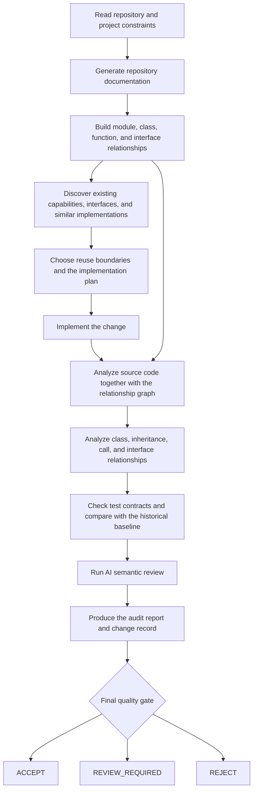
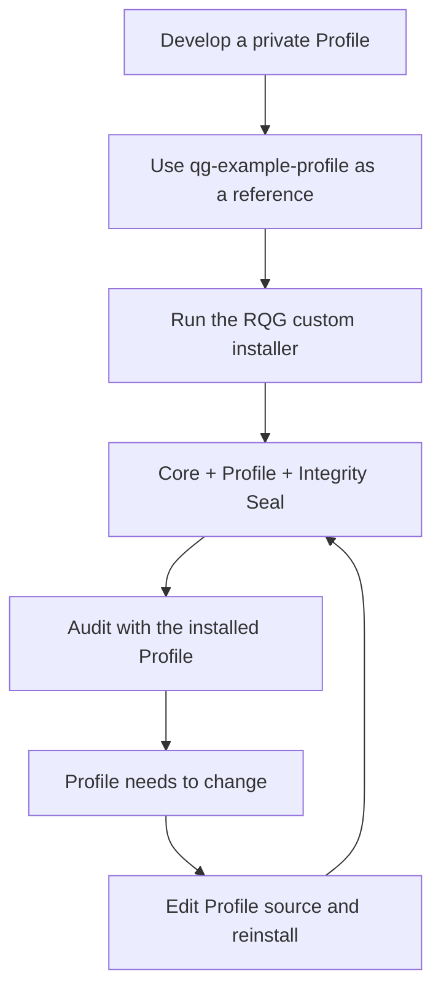

# Repository Quality Guard

English | [简体中文](README_zh.md)

Repository Quality Guard (RQG) is a **repository-level quality engineering workflow** for AI-assisted development and long-lived codebases.

RQG builds structured repository documentation and code relationship graphs, discovers existing capabilities and interfaces, analyzes source code together with module, class, inheritance, call, and test-contract relationships, and compares each change against historical baselines. Findings that require design or project context enter AI semantic review, producing an audit report, change record, and unified quality gate.

RQG organizes repository understanding, capability reuse, implementation, structural impact analysis, quality verification, and auditable delivery decisions into one repeatable development loop.

## Capabilities

- **Repository documentation** — organizes modules, classes, functions, interfaces, and important code entities into stable context for discovery and audit.
- **Code relationship graph** — models module dependencies, classes and inheritance, function calls, interface implementations, and cross-file references.
- **Existing capability discovery** — finds similar implementations, existing interfaces, and reusable infrastructure before new code is introduced.
- **Static and structural analysis** — combines source code and relationship data to analyze control flow, interface boundaries, complexity, fallbacks, dynamic execution, duplicate structures, and repository layout.
- **Class and interface contract analysis** — checks inheritance, overrides, method signatures, interface implementations, and cross-module contracts.
- **Test-contract analysis** — evaluates relationships between tests and production code, implementation coupling, stable behavior coverage, and test-baseline changes.
- **Historical baseline and delta analysis** — separates inherited debt, newly introduced issues, worsened findings, and absolute blockers.
- **AI semantic review** — gives context-dependent findings and their evidence to an AI reviewer, using stable review questions about necessity, capability reuse, ownership, interface synchronization, hidden fallbacks, test weakening, lifecycle constraints, and unauthorized semantic heuristics.
- **Project Profiles** — let repositories define rule levels, disabled rules, path policy, and project-specific static-analysis extensions.
- **Unified quality gate** — reports the final audit result as `ACCEPT`, `REVIEW_REQUIRED`, or `REJECT`.

### How AI semantic review works

Static rules provide reproducible facts. AI semantic review answers questions that require understanding code intent. The audit report organizes candidate findings, relationship evidence, and source context into stable questions such as:

- Does the change serve a clear observable requirement?
- Were existing repository capabilities searched and reused before a new interface was added?
- Does each new responsibility belong to the correct owner?
- Were parameter, return-shape, protocol, and public-interface changes synchronized with real consumers?
- Do fallbacks, dynamic attributes, or compatibility paths hide contract problems?
- Do tests verify stable behavior instead of the current implementation shape?
- Are cache, transaction, concurrency, lock, and resource-lifecycle ordering constraints preserved?
- Does a regular expression, keyword list, threshold, or other heuristic replace a decision that belongs to an explicit protocol, domain algorithm, or semantic model?

The AI records its reasoning against real code and structural evidence in the change report so later agents and developers can review the same evidence.

## Language support

RQG currently provides its deepest AST, class-relationship, interface, and source-level analysis for **Python**. It also supports static and repository-level analysis for **JavaScript, TypeScript, HTML, CSS, and C/C++**.

Repository-level capabilities such as Git history analysis, project structure, Profiles, documentation and configuration checks, relationship graphs, baseline comparison, semantic review, and quality gating can operate across mixed-language repositories. Source-level depth depends on the parser and rules available for each language.

## Development workflow



Each change starts from repository structure and existing capabilities, then re-checks structural impact, interface contracts, test contracts, historical quality changes, and semantic risks before delivery.

## Audit results

RQG has three formal final gate results:

| Result | Meaning |
| --- | --- |
| `ACCEPT` | The current change satisfies the automated and semantic audit requirements and can move to the next stage. |
| `REVIEW_REQUIRED` | The audit identified changes whose acceptability requires human confirmation, such as public-interface changes, compatibility changes, or important architectural-boundary changes. The Agent preserves the facts, impact, and evidence in the change report for that decision. |
| `REJECT` | The current change hits an explicit blocking condition and must be changed before it can pass. |

`修改说明.md` is shared by Agents and developers. Agents use it for semantic adjudication, verification, and follow-up work. When the result is `REVIEW_REQUIRED`, developers can inspect the same change facts, interface deltas, impact scope, and audit evidence before deciding whether the change is acceptable.

## Installation and Profile customization

RQG supports two usage modes: a generic installation for repositories that use the default Generic policy, and a custom installation for repositories that maintain private project Profiles.

### Generic installation

Install the public Skill with the standard Skill CLI:

```bash
npx skills add shijunfeng00/repository-quality-guard
```

This installs the RQG Core with the generic quality policy. It is intended for repositories that do not need project-specific rule policy, path policy, or static-analysis extensions.

### Build a project Profile

The public [`profiles/qg-example-profile`](profiles/qg-example-profile) directory is an executable reference. Copy it to a private Profile location, rename it, and adapt it to the project.

A Profile can contain:

```text
my-project-profile/
├── profile.json
└── extension.py        # optional
```

`profile.json` declares rule levels, disabled rules, non-blocking paths, test-baseline policy, and settings consumed by an extension. Projects that only need rule-level changes, exclusions, or path policy can stay entirely declarative.

Example:

```json
{
  "schema": "repository-quality-guard/profile-v1",
  "name": "my-project-profile",
  "entrypoint": "extension.py",
  "rules": {
    "levels": {
      "QG203": "BLOCKER",
      "QG205": "SEMANTIC"
    },
    "disable": ["QG187"]
  },
  "nonblocking_paths": [
    "tests/**",
    "tools/tracing.py"
  ]
}
```

This example shows rule promotion, semantic-review severity, project-level rule disablement, and path policy.

`extension.py` is the code-level plugin interface for project-specific static analysis that cannot be expressed in declarative JSON. The public example registers a stable state-mapping contract and callable contracts for a model adapter, allowing RQG to check project-specific type, interface, and structural invariants. An extension may also produce semantic-review evidence while the Profile controls the gate severity.

### Custom installation

After developing a Profile, use RQG's own installer to install the Core and the selected Profile together:

```bash
python runtime/deploy.py \
  /path/to/repository-quality-guard \
  /path/to/project/.agents/skills/repository-quality-guard \
  --profile /path/to/my-project-profile
```

The installer copies the selected Profile, writes the installed policy, and generates a new integrity seal. The installed Profile becomes the default policy and may also be selected explicitly by its authorized name:

```bash
python .agents/skills/repository-quality-guard/scripts/quality_guard.py \
  audit . --profile my-project-profile
```

The installed `.agents/skills/repository-quality-guard` directory is protected audit infrastructure. Direct changes to the Core, installed Profile, manifest, or other protected files fail QG990 integrity validation. To update, replace, or add a Profile, edit the Profile source and run the custom installation again so the installer creates a new valid installed state.



## Outputs

RQG produces the following primary artifacts during development and audit:

- **Repository documentation** — important modules, interfaces, reusable capabilities, and structural context.
- **Code relationship graph** — relationships among modules, classes, functions, and interfaces.
- **Audit report** — static findings, structural analysis, baseline deltas, semantic-review evidence, and gate results.
- **Change record** — the implemented change, interface deltas, validation evidence, semantic decisions, and impacts that require confirmation.
- **Project Profile** — repository-specific quality policy and static-analysis extensions.
- **Quality gate result** — `ACCEPT`, `REVIEW_REQUIRED`, or `REJECT` as the final audit state for the current change.
