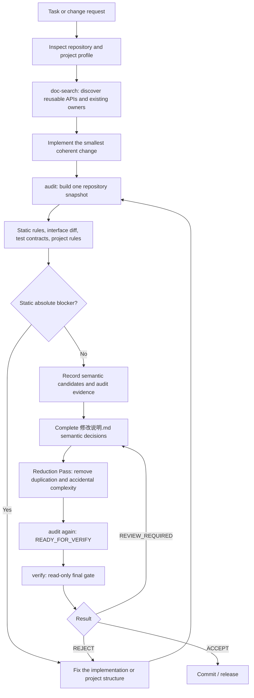

# Repository Quality Guard

English | [简体中文](README_zh.md)

Repository Quality Guard (RQG) is a repository-level quality gate and development workflow for AI-assisted software engineering. It combines reuse discovery, API cataloging, multilingual static analysis, project-specific policy, semantic adjudication, reduction, and a final read-only verification step around one repository snapshot.

Current stable version: **v0.20.1**.

RQG is not only a linter. It is intended to govern the full path from “understand the repository before changing it” to “prove the finished change is acceptable before release.” Machine checks produce facts and candidates; semantic decisions remain explicit and auditable.

## Development workflow



The separation between `audit` and `verify` is deliberate. `audit` may generate or refresh the evidence ledger; `verify` is read-only and evaluates whether the current repository state and its recorded decisions satisfy the gate.

## Quick start

Run the portable Skill directly after unpacking it:

```bash
python scripts/quality_guard.py doc-generate /path/to/repo
python scripts/quality_guard.py doc-search /path/to/repo "capability to reuse"
python scripts/quality_guard.py audit /path/to/repo --diff-base <commit>
python scripts/quality_guard.py verify /path/to/repo --diff-base <commit>
```

Install RQG into a repository:

```bash
python runtime/deploy.py \
  /path/to/repository-quality-guard \
  /path/to/repo/.agents/skills/repository-quality-guard
```

Then run the sealed installed copy:

```bash
QG=.agents/skills/repository-quality-guard
python "$QG/scripts/quality_guard.py" audit . --diff-base <commit>
python "$QG/scripts/quality_guard.py" verify . --diff-base <commit>
```

The positional target may be a Git repository, a non-Git directory, or a single file. Git-specific baseline/history checks are used when Git is available; lack of `.git` does not make the audit itself invalid.

## Stable commands

RQG exposes four primary agent-facing commands:

| Command | Purpose |
|---|---|
| `doc-generate` | Generate or incrementally refresh the repository API catalog. |
| `doc-search` | Search for reusable capabilities and likely owners before implementation. |
| `audit` | Scan the current state, update audit evidence, and determine whether it is ready for final verification. |
| `verify` | Perform the final read-only gate using the current repository state and completed audit record. |

## What the gate evaluates

The common runtime includes Python, JavaScript, TypeScript, CSS, HTML, and C/C++ analysis, together with API cataloging, relation graphs, interface diffs, test-contract analysis, repository structure checks, semantic candidates, report integrity, and release integrity.

A result can be:

- **ACCEPT** — the evaluated state satisfies the current policy.
- **REVIEW_REQUIRED** — machine facts are acceptable, but required semantic/audit evidence is incomplete or still needs adjudication.
- **REJECT** — an absolute blocker, current quality regression, report-integrity failure, or another rejecting condition is present.

Rule levels are policy, not decoration. In particular, **BLOCKER** is an absolute project gate and is not merely a stronger spelling of CRITICAL. A Profile can promote a generic rule to BLOCKER when the project contract requires that behavior.

## Portable, installed, and project profiles

A portable release may select a Profile explicitly:

```bash
python scripts/quality_guard.py audit /path/to/repo --profile /path/to/my-profile
```

Without `--profile`, RQG only auto-selects a local Profile when the target repository directory name exactly matches an available Profile directory. Otherwise it uses generic policy.

Deployment can freeze a Profile into the installed Skill:

```bash
python runtime/deploy.py \
  /path/to/repository-quality-guard \
  /path/to/repo/.agents/skills/repository-quality-guard \
  --profile /path/to/my-profile
```

Installed mode seals the selected policy and runtime payload under `.agents`. A user cannot later replace that policy with a runtime `--profile` override.

### Profile policy has one source of truth

Project policy belongs in `profile.json`. The common runtime interprets it; project-specific Python must not duplicate declarative policy.

For example:

```json
{
  "schema": "repository-quality-guard/profile-v1",
  "name": "my-project",
  "version": "1.0.0",
  "entrypoint": "extension.py",
  "agents_file": "AGENTS.md",
  "rules": {
    "disable": ["QG173"],
    "levels": {
      "QG203": "CRITICAL",
      "QG205": "SEMANTIC"
    }
  },
  "nonblocking_paths": [
    "tests/**"
  ],
  "test_baseline_passthrough_paths": [
    "utils/tracing.py"
  ],
  "settings": {
    "canonical_owner": "MyService"
  }
}
```

`extension.py` is optional. Use it only for genuinely custom AST rules, source contracts, search strategies, or report extensions that cannot be represented declaratively.

## Release-identity coupling

RQG separates project release lineage from legitimate long-lived versioned contracts:

- **QG203** is generic **CRITICAL** and only checks release-like identity embedded in repository paths or filenames. It remains baseline/history-aware; an old generic CRITICAL is not automatically an absolute rejection.
- **QG205** is generic **SEMANTIC** and identifies versions, release labels, Git tags, commits, SHA/digests, dependency/API/protocol/schema/migration versions, and similar content that requires semantic ownership analysis. A static match alone does not reject generic projects.
- `README.md` and `README_zh.md` are the only documentation exemptions because they are human-facing project entry points that may legitimately identify the current release. Migration, release, history, fixture, and other repository documents are not exempt merely because of their names.
- A project Profile may elevate either rule to **BLOCKER**. Historical BLOCKER findings remain absolute; baseline history cannot wash them out.

QG192 is separate: it detects tests coupled to production source/private helpers/source strings and implementation-history tombstones. A test may legitimately match both QG192 and QG203/QG205 when it encodes both forms of coupling.

## Authoring a project profile

A local Profile typically looks like this:

```text
profiles/my-project/
├── profile.json
├── extension.py       # optional
├── PROFILE.lock       # generated when custom QualityRule codes are frozen
├── AGENTS.md          # optional host bootstrap instructions
├── README.md          # optional authoring documentation
└── tests/             # optional profile-authoring tests
```

This repository intentionally ignores the whole `/profiles/` directory in Git. Private dogfood Profiles can therefore exist in a complete development checkout without entering public Git history. Internal distributions may include them explicitly.

### Optional Python extension

A Profile extension exports `Profile` and calls the common declarative configuration first:

```python
from runtime.src.profile_api import QualityGuardProfile


class Profile(QualityGuardProfile):
    name = "my-project"
    version = "1.0.0"

    def configure(self) -> None:
        super().configure()
        self.add_capability("my-capability")
```

`super().configure()` applies `profile.json`. Do not repeat rule levels, disabled rules, nonblocking paths, or other declarative policy in Python.

### Custom quality rules

For project-specific source semantics, define a `QualityRule` that returns standard `Finding` objects from a read-only `RuleContext`:

```python
import ast

from runtime.src.profile_api import Finding, QualityGuardProfile, QualityRule, RuleContext


class NoDangerousEval(QualityRule):
    key = "my-project.no-dangerous-eval"
    title = "Forbid direct eval"
    description = "Project code must not call eval() directly."
    severity = "error"
    scope = "repository"

    def evaluate(self, ctx: RuleContext):
        for path in ctx.analysis.paths:
            tree = ctx.python_ast(path)
            if tree is None:
                continue
            for node in ast.walk(tree):
                if isinstance(node, ast.Call) and isinstance(node.func, ast.Name) and node.func.id == "eval":
                    yield Finding(
                        code="",
                        severity=self.severity,
                        confidence="high",
                        path=path,
                        line=getattr(node, "lineno", 1),
                        column=getattr(node, "col_offset", 0) + 1,
                        message="Direct eval() call detected.",
                        suggestion="Use an explicit parser or a bounded protocol instead.",
                        source=self.key,
                    )


class Profile(QualityGuardProfile):
    name = "my-project"

    def configure(self) -> None:
        super().configure()
        self.add_rule(NoDangerousEval)
```

Useful `RuleContext` entry points include `ctx.source(path)`, `ctx.python_ast(path)`, `ctx.analysis`, `ctx.base_analysis`, `ctx.interface_diff`, and `ctx.settings`.

Custom rule identity is the stable rule key. If a rule does not define a display code, freeze one during authoring:

```bash
python runtime/profile_build.py profiles/my-project
```

This creates or updates `PROFILE.lock`; new keys receive stable display codes from the `QG10000+` range and removed codes are not recycled.

Profiles may also register `SearchStrategy`, `ReportExtension`, and `RulePack` implementations. RQG never imports arbitrary Python from the repository being audited; executable extensions come from the trusted Skill/Profile distribution.

## `AGENTS.md` ownership

A Profile `AGENTS.md` is a complete instruction file, not a render template.

During deployment:

- an existing host-root `AGENTS.md` is preserved byte-for-byte;
- if the host has no root `AGENTS.md` and the selected Profile declares `agents_file: "AGENTS.md"`, that file is copied once;
- otherwise RQG may use its generic bootstrap resource.

Profile authoring assets such as `AGENTS.md`, `README.md`, `README_zh.md`, and `tests/` do not become part of the installed runtime Profile payload.

## Distribution boundaries

| Asset | Complete Git / Skill distribution | Installed `.agents` |
|---|---:|---:|
| `.git/` | optional for the development archive | ✗ |
| `README.md` / `README_zh.md` | ✓ | ✗ |
| `dev-tests/` | ✓ | ✗ |
| authoring/release `tools/` | ✓ | ✗ |
| `profiles/` | optional/private, Git-ignored | only the selected runtime profile payload |
| Profile `AGENTS.md` / README / tests | optional | ✗ |
| `offline/wheelhouse` | ✓ in the complete release | ✗ |
| `offline/node_modules.zip` | ✓ in the complete release | ✗ |
| `runtime/src` | ✓ | ✓ |
| `installed/POLICY.json` | ✗ | ✓ |

A complete development archive may therefore also be a valid Skill distribution: `.git` supports repository development, while `SKILL.md` and the runtime tree provide the Skill surface. Deployment strips source-only and authoring-only assets.

## Exit codes

Primary exit codes:

- `0`: success; `audit` is `READY_FOR_VERIFY`, or `verify` is `PASS`;
- `1`: `verify REJECT`;
- `2`: CLI, Profile, dependency, or environment error;
- `3`: audit report is incomplete or rejected by the report contract;
- `4`: release-integrity failure;
- `5`: `verify REVIEW_REQUIRED`.

## Development and references

Run the development suite from the repository root:

```bash
python -m pytest -q dev-tests
python -m ruff check runtime dev-tests tools scripts
```

The main references are:

- `SKILL.md` — agent-facing operating contract;
- `references/RULES.md` — rule catalog and gate semantics;
- `references/AUDIT.md` — audit/report workflow;
- `references/CODING_GUIDE.md` — development constraints and release discipline.

For the Chinese documentation, see [README_zh.md](README_zh.md).
