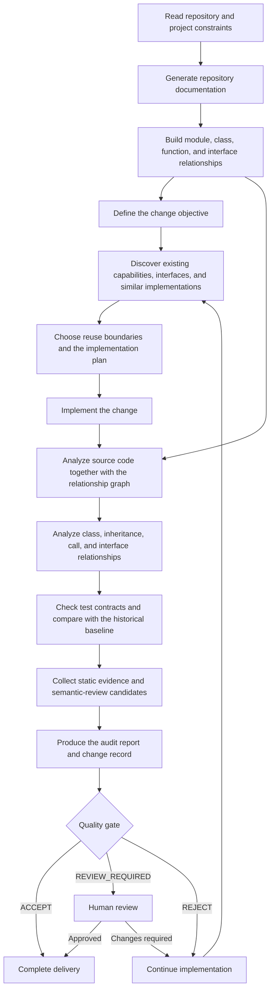

# Repository Quality Guard

English | [简体中文](README_zh.md)

Repository Quality Guard (RQG) is a **repository-level quality engineering workflow** for AI-assisted software development and long-lived codebases.

It builds structured repository documentation and code relationship graphs, discovers existing capabilities and interfaces, analyzes source code together with module, class, inheritance, call, and test-contract relationships, and compares each change against historical baselines. Findings that require contextual judgment enter semantic review, producing a unified quality gate, audit report, and change record.

RQG turns repository understanding, capability reuse, implementation, structural impact analysis, quality verification, and delivery decisions into one repeatable development loop.

## Capabilities

- **Repository documentation** — organizes modules, classes, functions, interfaces, and important code entities into stable context for later analysis.
- **Code relationship graph** — models module dependencies, classes and inheritance, function calls, interface implementations, and cross-file references.
- **Existing capability discovery** — finds similar implementations, existing interfaces, reusable infrastructure, and likely code owners before new code is introduced.
- **Static and structural analysis** — combines source code and relationship data to analyze control flow, interface boundaries, complexity, fallbacks, dynamic execution, duplicate structures, and repository layout.
- **Class and interface contract analysis** — checks inheritance, overrides, method signatures, interface implementations, and cross-module contracts.
- **Test-contract analysis** — evaluates relationships between tests and production code, implementation coupling, and test-baseline changes.
- **Historical baseline and delta analysis** — separates inherited debt, newly introduced issues, worsened findings, and absolute blockers.
- **Semantic review** — routes context-dependent findings into explicit adjudication with auditable evidence.
- **Project Profiles** — let each repository define rule levels, path exemptions, structural contracts, and custom checks.
- **Unified quality gate** — reports the final state as `ACCEPT`, `REVIEW_REQUIRED`, or `REJECT`.

## Language support

RQG currently provides its deepest AST, class-relationship, interface, and source-level analysis for **Python**. It also supports static and repository-level analysis for **JavaScript, TypeScript, HTML, CSS, and C/C++**.

Repository-level capabilities such as Git history analysis, project structure, Profiles, documentation and configuration checks, relationship graphs, baseline comparison, semantic review, and quality gating can operate across mixed-language repositories. Source-level depth depends on the parser and rules available for each language.

## Development workflow



This workflow keeps implementation grounded in repository structure, existing capabilities, and historical baselines, then re-evaluates the effect of each change before delivery.

## Installation

RQG follows the standard Skill directory layout and can be installed as an Agent Skill or maintained as a regular Git repository.

Install with the standard Skill CLI:

```bash
npx skills add shijunfeng00/repository-quality-guard
```

Or clone the repository directly:

```bash
git clone https://github.com/shijunfeng00/repository-quality-guard.git
```

A complete release archive can include both Git history and offline runtime dependencies for full development checkouts and restricted-network environments.

## Outputs

RQG produces the following primary artifacts during development and audit:

- **Repository documentation** — important modules, interfaces, reusable capabilities, and structural context.
- **Code relationship graph** — relationships among modules, classes, functions, and interfaces.
- **Audit report** — static findings, structural analysis, baseline deltas, semantic-review candidates, and gate results.
- **Change record** — the implemented change, validation evidence, semantic decisions, and items that still require review.
- **Project Profile** — repository-specific quality policy and architectural constraints.
- **Quality gate result** — `ACCEPT`, `REVIEW_REQUIRED`, or `REJECT` for the current repository state.
