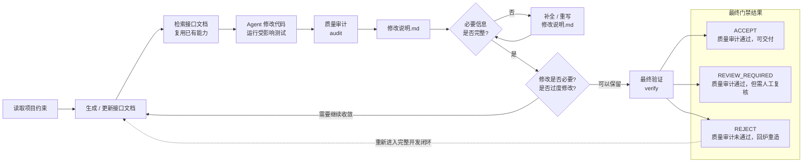

<div align="center">

# Repository Quality Guard

### 面向 Coding Agent 的标准化高质量代码开发流程与审计 Skill

**拒绝 Agent 在几千行 `git diff` 里夹带私货。**

不只是检查 Agent 写出的代码，而是通过可执行规则约束 Agent **应该怎样完成一次高质量代码开发与交付**：先看懂项目现有结构，先找项目里有没有现成实现，再修改代码；修改必须充分披露、解释为什么有必要，测试必须验证真正的功能，最终交付必须拿出以后可以重新检查的证据。

你可以把它理解成：**给 Coding Agent 安装的一套开发规则、质量检查工具和 Git 交付门禁。**

**代码质量审核不过关 → 给出详细质量问题报告 → Agent 拿着报告回炉重造 → 重新审计 → 重新验证。**

这不是 Checklist，也不是编码风格指南，而是一套 **强制高质量交付流程**。

[](https://github.com/shijunfeng00/repository-quality-guard/tags)
[](references/RULES.md)


[English](README.md) · **简体中文** · [完整 QG 规则](references/RULES.md) · [项目定制](#项目定制让-rqg-适配你的仓库) · [版本标签](https://github.com/shijunfeng00/repository-quality-guard/tags)

</div>

---

## 目录

- [一句话理解 Repository Quality Guard](#一句话理解-repository-quality-guard)
- [支持语言](#支持语言)
- [为什么需要 Repository Quality Guard？](#为什么需要-repository-quality-guard)
- [这正是 Repository Quality Guard 要解决的问题](#这正是-repository-quality-guard-要解决的问题)
- [重新定义人和 Agent 的协作模式](#重新定义人和-agent-的协作模式)
- [快速开始](#快速开始)
- [RQG 如何确保 Agent 产出的代码质量](#rqg-如何确保-agent-产出的代码质量)
- [`修改说明.md`：Agent 不能跳过的交付答卷](#修改说明mdagent-不能跳过的交付答卷)
- [代码质量审核不过关？拿着报告回炉重造](#代码质量审核不过关拿着报告回炉重造)
- [项目定制：让 RQG 适配你的仓库](#项目定制让-rqg-适配你的仓库)
- [License](#license)

---

# 一句话理解 Repository Quality Guard

**拒绝 Agent 在几千行 `git diff` 里夹带私货。** RQG 不只是检查 Agent 写出的代码，而是约束 Agent **应该怎样完成一次高质量代码开发与交付**：代码质量审核不过关，就给出详细质量问题报告，让 Agent 拿着报告回炉重造，修改以后重新审计、重新解释、重新验证。

**不是建议，不是 Checklist，不是编码风格指南，而是一套 Agent 自己不能只靠嘴糊弄过去的强制高质量交付流程。**

> **不要相信 Agent 说“完成了”。让它拿证据过门。**

RQG 也不是一套只能原样使用的固定规则：你可以针对自己的项目调整哪些问题必须拦截、哪些目录要更严格、哪些情况允许例外，还可以增加项目自己的检查规则，而不需要修改 RQG 本体。详见 **[项目定制](#项目定制让-rqg-适配你的仓库)**。

---

# 支持语言

RQG 当前覆盖 **Python、JavaScript、TypeScript、CSS、HTML 和 C/C++**。不同语言能检查到的深度不同，其中 Python 最完整。

| 语言 | 目前能检查什么 |
| --- | --- |
| **Python** | 最完整：能理解函数、类、继承、接口变化、调用关系、受影响测试，以及项目自己的定制规则 |
| **JavaScript / TypeScript** | 能检查代码结构、复杂度、重复定义，以及部分调用和职责归属问题 |
| **CSS** | 主要检查语法、重复样式块等结构问题 |
| **HTML** | 主要检查基础结构问题，例如重复 `id` |
| **C / C++** | 通过 Clang 分析本次修改涉及的函数、分支、嵌套和复杂度变化 |

即使一个仓库同时包含多种语言，RQG 仍然可以统一管理本次修改范围、`修改说明.md`、项目定制规则和最终 Git 交付门禁。需要的语法分析器缺失时，RQG 不会悄悄降级后假装“检查通过”。

---

## 为什么需要 Repository Quality Guard？

Coding Agent 已经可以在几分钟内修改几十个文件、几百个函数和几千行代码。真正的问题正在从“它会不会写代码”变成：**这几千行到底为什么要改？哪些修改真的有必要？它有没有重复造轮子、破坏接口和继承关系、用 fallback 掩盖 BUG、让测试迎合实现、制造新的技术债？最后又凭什么证明这份代码值得被合并？**

Repository Quality Guard 是在**时间跨度超过一年**的一次次真实 Agent 开发事故中逐渐长出来的。回想一下，你是否也曾因为下面这些问题大发雷霆？

### 1. 小需求变成巨型 `git diff`

本来只是局部小修改，Agent 却顺手格式化代码、给函数增加参数并一路传播，再加入辅助函数（helper）、包装层（wrapper）、新状态、兼容分支和兜底逻辑（fallback）。一个小问题最后扩张到 **1000+ 行 diff、20 多个文件和两位数新增接口**。每一个修改单独问似乎都有理由，但合起来已经远远超过需求本身。

Agent 很擅长增加代码，但成熟仓库真正困难的往往是**克制它不要乱动**。随着 Agent 能力越来越强，每次能够生成的代码越来越多、修改越来越复杂，如果靠人逐行检查几千行 diff，Agent 节省下来的编码时间又会被 Code Review 吃回去；如果不审，仓库又很容易在几轮修改后迅速屎山化。

### 2. 已经有的能力被重新造了一遍

父类明明已经存在公共能力，Agent 重构时却忽略甚至删除它，再在各个子类里重新实现近似逻辑；已有公共方法被绕开，同一职责开始散落到不同辅助函数、不同子类和不同调用路径。

新代码能运行，局部测试也能通过，但仓库已经开始产生重复实现、职责漂移和新的跨层耦合。下一次 Agent 又会继续在这些重复实现上修改，再堆出更多重复代码，结果就是：**越来越多的代码、越来越模糊的职责、越来越没人敢动的屎山。**

### 3. BUG 没修掉，只是被 fallback 藏起来了

明明应该删除错误逻辑、统一数据契约或者直接暴露异常，Agent 却不断增加 `if/else`、`isinstance`、`hasattr`、默认值、辅助函数、旧兼容分支和 fallback（失败时走另一条兜底路径）。旧实现有问题却**保留不删**，新实现出了问题又悄悄 fallback 回旧实现，不敢让任何一条路径成为唯一正确实现，于是两套甚至三套逻辑长期并存。

再配上宽泛的 `Exception` 捕获并直接丢弃不处理——我们将这种模式称为 **`try-except-pass`**——真正的 BUG 并没有消失，只是变得越来越难发现。代码表面上似乎“兼容性更好”“更健壮”，实际上却是错误路径倍增、重复代码堆积、异常被悄悄吞掉，最后甚至没人知道**哪条路径才是真正正确的路径**。

### 4. 测试不仅没验证真正的功能，反而把错误实现永久固化下来

Agent 在修改代码的同时大量补充单元测试、回归测试和冒烟测试，看起来测试数量越来越多、覆盖率越来越高，但很多测试验证的并不是“功能是否正确”，而只是确保：

**当前这次 diff 永远保持原样。**

你删除一个函数，它写 `assert not hasattr(module, "old_function")`；你迁移一套实现，它把旧的流程 ID、类名、接口名、模块路径甚至某段固定调用方式直接写死进测试断言；你修改一份 DSL、配置或者自然语言报告，它甚至可能用**正则表达式强制要求某段文本必须永远包含某个关键词**。你修改一个实现细节，它就把这个实现细节变成新的“测试契约”，并确保它以后永远存在。

更糟的是，当正式代码修改后已有测试失败，Agent 也未必先怀疑实现本身。它可能删除关键断言、修改预期结果、直接跳过失败测试，甚至重新生成一批测试来证明“当前实现就是正确答案”。有时即使你已经明确要求删除某段错误实现，它仍然会因为现有测试全部建立在旧实现之上，而认为**当前能够通过测试的代码才是正确答案**。

当你终于发现原来的架构有问题，准备做一次真正正确的重构时，会发现几十甚至几百个测试都在阻止你：旧函数必须继续存在，旧类名不能改变，旧调用链必须保持原样，旧 procedure 必须继续这样组织，这个 helper 必须永远留在这里，这段源码甚至这几个关键词都必须继续长成昨天的样子。

**错误的实现被测试焊死在了仓库里。**

长此以往，很多真正的 BUG 会变得极其难以修改。哪怕你明确要求“把这个函数彻底删除”，Agent 也可能因为历史测试和兼容逻辑而拒绝删除，或者把它挪进 `/history`、历史兼容分支或另一个兼容路径里换一种方式继续存在；直到某一天，另一个 Agent 在检索“已有能力”时又把这段本该死掉的代码从垃圾桶里翻出来重新复用。

最危险的不是 Agent 写错，而是它还能把错误闭环“证明”成正确，你会得到一个看起来非常完整的闭环：

```text
Agent 做出假设
        ↓
Agent 修改实现
        ↓
Agent 编写 / 修改测试
        ↓
测试全部通过
        ↓
Agent 宣布修改已经验证
```

于是一个核心问题浮出水面：

**谁来约束 Agent 自己真的遵守了你的规定？让另一个 Agent 来审核 Agent 吗？那谁又能保证另一个 Agent 一定遵守了你的要求？**

---


**Agent 不能只说“完成了”。它必须拿出可以重新验证的证据。**

---


## 这正是 Repository Quality Guard 要解决的问题

你需要的不是另一份更长的 Agent 编码规范，而是一个 **Agent 自己不能只靠嘴糊弄过去的开发流程**。RQG 把“先看看项目里有没有现成实现，再改代码，再检查，再解释为什么这样改，最后重新验证”变成必须完成的交付闭环。代码有问题，就拿着问题报告回炉重造；`修改说明.md` 没填完整，就不能继续；修改范围明显过大，就继续删减和收敛。只有**最新代码、最新报告和最新检查证据**都通过最终验证（`verify`），才会得到正式结果。

### 一条完整的高质量代码开发闭环



这里有两个不同的环路：**报告缺字段时只重写 `修改说明.md`，不会假装通过；一旦代码需要继续修改，或者最终结果为 `REJECT`，就重新回到接口文档与已有能力检索，再走完整闭环。** 这样回炉重造以后仍然会重新检查：是不是又造了一套重复接口、这项能力是不是放错了位置、是不是又引入新的 fallback，或者把一个本来局部的参数传遍了很多层。

`audit` 是质量扫描步骤，会生成或刷新 `修改说明.md`；`verify` 是最后一步，只负责重新检查，不再替 Agent 改代码。报告没完成时，不能被当成最终质量结论。最终 `verify` 之后，只要源码、配置、接口索引或报告再次发生变化，原来的结论就失效，必须重新闭环。

---

# 重新定义人和 Agent 的协作模式

RQG 不是再增加一个“让 AI 审核 AI”的 Agent，而是把工作拆成三部分：**Agent 负责写和解释，RQG 用不依赖 Agent 自我评价的规则负责检查和拦截，人只决定机器不该替你决定的事情。**

| 角色 | 主要职责 |
| --- | --- |
| **RQG** | 用固定规则检查“到底改了什么”：代码、接口、继承关系、调用关系、测试、修改前后差异和报告是否完整，并决定能不能进入交付 |
| **Agent** | 理解需求、先找现有实现、修改代码、修复质量问题，并解释“为什么必须这样改”，补全 `修改说明.md` |
| **人** | 定义真正想要的功能，只处理 `REVIEW_REQUIRED` 中必须由人决定的事情，例如是否允许破坏兼容性、是否接受重要设计变化 |

`修改说明.md` 正是三者之间的交接面：**RQG 先写入可以由程序直接检查的事实，Agent 必须阅读这些事实并逐项解释、举证；最终 `verify` 再用最新源码和证据检查报告是否完整、是否与事实一致。** Agent 不能靠写一段“我认为没问题”把 `REJECT` 洗成通过，而人也不需要重新从几千行 `git diff` 开始考古。

> **Agent 负责执行、解释和举证；RQG 负责约束、核验和阻断；人只处理真正需要人做决定的事情。**

---

# 快速开始

RQG 以 Agent Skill 的形式安装到项目中。这里的 Skill，可以简单理解成**给 Coding Agent 安装的一套可执行工作规则和工具**。安装完成后，你不需要每次自己手动跑一长串命令；Agent 应按照这套流程主动完成接口文档更新、已有能力检索、质量检查、问题修复、`修改说明.md` 和最终验证。

```bash
# 1. 安装 Repository Quality Guard
npx skills add shijunfeng00/repository-quality-guard

# 2. 安装运行依赖
python .agents/skills/repository-quality-guard/runtime/install_dependencies.py

# 3. 安装 Git 交付质量门禁
python .agents/skills/repository-quality-guard/scripts/git_hook_install.py .
```

RQG 为 Agent 提供的稳定流程能力包括：

```text
doc-generate   把项目现有函数 / 类 / 接口整理成可检索的文档
doc-search     在这些文档里找现成接口、相似能力和真正负责这项能力的位置
audit          扫描本次修改，发现质量问题并维护 修改说明.md
verify         最后重新检查最新代码、报告和证据，给出最终门禁结果
```

普通使用者通常不需要逐条运行这些命令。它们是 Agent 完成一次开发任务时应该主动执行的标准流程。

想先看完整规则，可以直接阅读：**[`references/RULES.md`](references/RULES.md)**

---

# RQG 如何确保 Agent 产出的代码质量

RQG 不是靠一句“请认真检查代码”保证质量，而是把多种检查放在一起：**看清本次到底改了什么、用固定规则找问题、要求 Agent 解释修改理由、生成结构化报告，并在 Git 交付前再设一道门。** 最终要回答两个问题：**Agent 到底改了什么？这些修改为什么值得留下来？**

| 机制 / 产物 | 它实际做什么 | 主要解决的问题 |
| --- | --- | --- |
| **接口文档与已有能力检索** | Agent 新增函数、类或接口前，先查项目里有没有现成能力可以复用或扩展 | 重复造轮子、同一功能出现很多套实现 |
| **QG 质量规则** | 用数百项固定编号的规则检查代码结构、异常处理、接口变化、测试和修改范围 | 无意义辅助层、异常吞噬、fallback 堆叠、复杂度持续上升 |
| **修改前后关系分析** | 比较修改前后哪些接口、调用关系、继承关系和测试被影响 | 参数传遍很多层、职责被挪错位置、一次小改动影响半个仓库 |
| **测试质量审计** | 检查测试有没有删断言、跳过失败、硬编码源码形状或强制某个关键词永远存在 | 防止测试迎合当前 diff，再把错误实现永久焊死 |
| **`修改说明.md`** | 自动写入修改事实，再强制 Agent 解释为什么要这样改、为什么不能复用、怎么验证 | 防止 Agent 用一句“已经完成、测试通过”代替真正举证 |
| **修改必要性审查** | 在交付前再问一次：是不是改多了？有没有代码可以删、合并或复用？ | 小需求膨胀成巨型 diff、过度设计和不必要兼容 |
| **最终验证 `verify`** | 用最新代码、最新报告和最新证据重新计算最终状态；后续再改代码，旧结论立即失效 | 拿旧报告、旧测试结果冒充当前代码已经通过 |
| **Git 交付门禁** | 保护 RQG 自己的规则不被 Agent 顺手改掉，并在 `git push` 前再次检查 | 防止 Agent 修改“裁判”或绕过 `REJECT` 正常交付 |

其中 **QG 不是让 AI 凭感觉打分**。每条 QG 都有固定编号，代表一个可以被程序检查的质量问题或交付条件。比如：

| 示例 | 关注问题 |
| --- | --- |
| `QG001` | 无意义的辅助函数、包装层等代码坏味道 |
| `QG170–QG175` | 测试删除、断言减少、skip / xfail、新测试无有效断言等 |
| `QG192–QG194` | 正式代码已经修改，但相关测试没有验证真正行为，或测试过度绑定实现细节 |
| `QG980–QG985` | `修改说明.md` 是否完整、Agent 的解释是否和事实一致、最终验证是否成立 |
| `QG990` | RQG 自己的规则、配置和关键文件有没有被偷偷改掉 |

这些检查最后只会得到三个结果：**`ACCEPT`** = 质量检查通过，可以正常交付；**`REVIEW_REQUIRED`** = 质量检查通过，但有某些重要变化必须由人确认；**`REJECT`** = 当前代码不合格，Agent 必须继续修改。

完整 QG 定义以 **[`references/RULES.md`](references/RULES.md)** 为准。

---

# `修改说明.md`：Agent 不能跳过的交付答卷

`修改说明.md` 是 RQG 最核心的交付物之一。它不是普通的“我改了什么”工作总结，而是一份**强制审计答卷**。RQG 会先自动写入本次改了哪些文件、接口、调用关系、测试，以及 QG 检查发现了什么问题；随后 Agent 必须继续回答“为什么必须这样改”。最后，`verify` 再检查这份报告是否完整、是否和当前代码真的一致。

它至少要回答这些问题：

- 改了哪些文件、接口、类、函数、调用关系和测试？
- 新增能力之前是否找过项目里的现成实现？为什么不能直接复用或扩展？
- 为什么要新增接口、参数、状态、辅助函数或 fallback？
- 公共接口有没有变化？父类、子类的职责有没有被挪乱？某项能力是不是放到了不该负责的位置？
- 测试修改是在保护真实行为，还是只是在保护当前 diff？
- 修改必要性审查之后，还有什么可以删除、合并、复用或收紧？
- 最终运行了什么真实验证，还有哪些风险需要人工确认？

很多代码在“能运行、测试全绿”以后看起来已经完成，但一旦要求 Agent 把这些问题写清楚，就会暴露出重复实现、接口扩散、fallback 堆叠、测试迎合实现等问题。**如果报告解释不通，正确动作不是把报告写得更漂亮，而是回去改代码。**

一个简化后的报告大致包含：

```markdown
# 修改说明

## 变更事实
- 修改文件 / 接口 / 调用方 / 测试
- 本轮新增或变严重的 QG 问题

## 关键修改
- 为什么必须修改
- 已有能力检索结果
- 为什么不能复用
- 影响范围

## 测试与修改必要性审查
- 测试为什么变化
- 删除 / 合并 / 复用了什么

## 验证与风险
- 实际验证结果
- 剩余风险与 REVIEW_REQUIRED 事项
```

**Agent 必须阅读并补全这份报告，但它没有资格自己宣布“报告合格”。** 缺少必要字段、与扫描事实冲突、证据过期或最终 `verify` 不通过，都会阻止它成为有效交付证据。

---

# 代码质量审核不过关？拿着报告回炉重造

RQG 的审核结果不是一句模糊的“建议优化”。发现明确问题时，会告诉 Agent **哪里有问题、为什么有问题、哪条规则没有通过**。结果为 **REJECT** 时，Agent 必须拿着这份问题报告重新改代码，再次检查、补全报告并重新执行最终验证。

**代码质量审核不过关 → 给出详细质量问题报告 → 回炉重造 → 重新审计 → 重新验证。**

静态 `REJECT` 不能因为 Agent 写了一段“综合考虑后可以接受”就被洗成通过。这不是建议，不是编码风格指南，也不是 Code Review Checklist，而是**强制高质量交付流程**。

---

# 项目定制：让 RQG 适配你的仓库

RQG 自带的是**通用质量规则**，但每个项目都会有自己的特殊约束：例如核心目录必须更严格、某些规则在测试目录可以放宽、某个公共接口绝对不能随意改、某个状态对象的字段结构必须保持稳定。你不需要修改 RQG 本体来实现这些要求，而是给项目增加一个 **Profile**。

可以把 Profile 理解成：**告诉 RQG“这个仓库有哪些额外规矩”**。一个 Profile 通常就是一个小目录：

```text
profiles/my-project/
├── profile.json      # 大多数定制都写在这里
└── extension.py      # 可选：JSON 表达不了的检查才需要写代码
```

## 先从 `profile.json` 开始

如果你只是想调整规则严重程度、关闭某条不适合本项目的规则，或者声明哪些路径不应该阻断交付，**只写 JSON 就够了，不需要写 Python**。

例如：

```json
{
  "schema": "repository-quality-guard/profile-v1",
  "name": "my-project",
  "version": "1",
  "rules": {
    "levels": {
      "QG203": "BLOCKER",
      "QG205": "SEMANTIC"
    },
    "disable": [
      "QG187"
    ]
  },
  "nonblocking_paths": [
    "tests/**"
  ]
}
```

这段配置表达的意思很直接：

- `name`：这个项目规则集叫什么；
- `rules.levels`：调整某些 QG 规则在本项目里的严重程度，例如直接阻断或进入语义审计；
- `rules.disable`：明确关闭确实不适合本项目的规则；
- `nonblocking_paths`：这些路径仍然会被检查，但问题不会直接阻断正常交付。

具体有哪些 `QGxxx` 可以配置，可以直接查看 **[完整 QG 规则](references/RULES.md)**。不要为了让当前代码过审而临时关闭规则；Profile 本身也是受保护的质量配置。

## JSON 不够时，再写 `extension.py`

有些项目约束不是“把某条规则调高或调低”能表达的。例如：

- 某个核心类的方法签名不能被 Agent 随意改掉；
- 某个状态对象必须保留固定字段；
- 项目有自己的 AST、接口、继承或调用关系约束；
- 某类高风险结构只在这个仓库里存在。

这时可以在 Profile 里增加 `extension.py`，把项目专属检查写成代码。`profile.json` 通过 `entrypoint` 指向它，并可以通过 `settings` 把路径、类名等项目配置传进去：

```json
{
  "schema": "repository-quality-guard/profile-v1",
  "name": "my-project",
  "version": "1",
  "entrypoint": "extension.py",
  "settings": {
    "adapter_path": "app/model_adapter.py",
    "adapter_type": "ModelAdapter"
  }
}
```

对应的 `extension.py` 可以读取这些配置，并注册真正的代码级契约。例如下面这个简化示例会告诉 RQG：`ModelAdapter.generate` 是项目的重要接口，需要检查它的参数和返回类型是否被意外改坏。

```python
from runtime.src.profile_api import CallableContract, QualityGuardProfile


class Profile(QualityGuardProfile):
    name = "my-project"

    def configure(self) -> None:
        super().configure()

        adapter_path = str(self.settings["adapter_path"])
        adapter_type = str(self.settings["adapter_type"])

        self.add_values(
            "callable_contracts",
            CallableContract(
                adapter_path,
                f"{adapter_type}.generate",
                (
                    ("self", "positional_or_keyword", False),
                    ("messages", "positional_or_keyword", False),
                    ("stop", "positional_or_keyword", True),
                    ("kwargs", "var_keyword", False),
                ),
                ("ModelResponse",),
                False,
            ),
        )
```

你不需要一开始就写这种扩展。**只需要规则等级、禁用项和路径策略时，用 `profile.json`；只有项目真的存在专属代码契约时，才增加 `extension.py`。**

这样，通用问题继续由 RQG Core 负责，你自己的工程规则留在自己的 Profile 里；升级 RQG 时，也不需要重新修改通用 Core。

完整可执行示例已经放在仓库里，里面同时展示了 JSON 配置、路径策略、`settings` 传参，以及 Python 扩展如何注册状态对象和接口契约：

**➡️ [查看完整 Profile 示例：`profiles/qg-example-profile/`](profiles/qg-example-profile/)**

---

# License

Repository Quality Guard 使用 **Apache License 2.0** 开源。

你可以在遵守许可证条款的前提下使用、修改和分发本项目。完整许可证内容见仓库根目录的 [`LICENSE`](LICENSE)。

---
