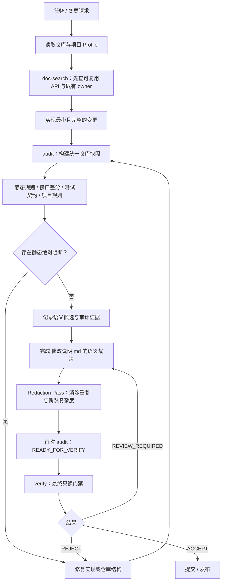

# Repository Quality Guard

[English](README.md) | 简体中文

Repository Quality Guard（RQG）是一套面向仓库的代码质量门禁与 AI 辅助开发流程。它把复用检索、API catalog、多语言静态分析、项目 Profile、语义裁决、Reduction Pass 和最终只读验证统一到同一份仓库快照上。

当前稳定版本：**v0.20.1**。

RQG 不只是一个 linter。它希望约束的是从“改代码前先理解现有能力”到“发布前证明最终状态满足质量要求”的完整开发闭环。机器规则负责产生事实和候选；真正需要语义判断的地方则必须显式记录、可回溯审计。

## 开发流程



`audit` 与 `verify` 的分离是刻意设计：`audit` 可以生成或刷新证据账本；`verify` 必须只读，只根据当前仓库状态和已经完成的审计记录给出最终门禁结论。

## 快速开始

完整 Portable Skill 解压后可以直接运行：

```bash
python scripts/quality_guard.py doc-generate /path/to/repo
python scripts/quality_guard.py doc-search /path/to/repo "需要复用的能力"
python scripts/quality_guard.py audit /path/to/repo --diff-base <commit>
python scripts/quality_guard.py verify /path/to/repo --diff-base <commit>
```

安装到目标仓库：

```bash
python runtime/deploy.py \
  /path/to/repository-quality-guard \
  /path/to/repo/.agents/skills/repository-quality-guard
```

安装后运行冻结的 Skill：

```bash
QG=.agents/skills/repository-quality-guard
python "$QG/scripts/quality_guard.py" audit . --diff-base <commit>
python "$QG/scripts/quality_guard.py" verify . --diff-base <commit>
```

位置参数既可以是 Git 仓库，也可以是非 Git 目录或单文件。存在 Git 时使用 baseline/history 能力；缺少 `.git` 本身不会被视为审计执行失败。

## 稳定命令

RQG 对 Agent 暴露 4 个主要一级命令：

| 命令 | 用途 |
|---|---|
| `doc-generate` | 生成或增量刷新仓库 API catalog。 |
| `doc-search` | 实现前检索可复用能力与已有 owner。 |
| `audit` | 扫描当前状态、刷新审计证据，并判断是否已可进入最终验证。 |
| `verify` | 在不修改仓库的前提下执行最终门禁。 |

## 门禁检查什么

通用 runtime 覆盖 Python、JavaScript、TypeScript、CSS、HTML 与 C/C++，并组合 API catalog、RelationGraph、接口差分、测试契约、仓库结构、语义候选、报告完整性和 release integrity 检查。

结果主要分为：

- **ACCEPT**：当前状态满足策略；
- **REVIEW_REQUIRED**：机器事实没有直接拒绝，但必要的语义/审计证据仍不完整；
- **REJECT**：存在 absolute blocker、当前质量回归、报告完整性失败或其他拒绝条件。

Rule level 是正式策略而不是显示标签。特别是 **BLOCKER** 是独立的绝对门禁，不是“更严重的 CRITICAL”。项目 Profile 可以按自己的契约把通用规则提升为 BLOCKER。

## Portable、Installed 与项目 Profile

Portable release 可以显式选择 Profile：

```bash
python scripts/quality_guard.py audit /path/to/repo --profile /path/to/my-profile
```

没有显式 `--profile` 时，只有目标仓库目录名与实际存在的 Profile 目录名完全一致才自动匹配，否则使用 generic policy。

部署时也可以冻结 Profile：

```bash
python runtime/deploy.py \
  /path/to/repository-quality-guard \
  /path/to/repo/.agents/skills/repository-quality-guard \
  --profile /path/to/my-profile
```

Installed 模式会把选中的 policy 与运行 payload seal 到 `.agents` 中，运行时不能再通过用户 `--profile` 替换策略。

### Profile 策略只有一个事实源

项目策略应写在 `profile.json`，由通用 runtime 解释；项目扩展 Python 不应再复制一遍声明式策略。

例如：

```json
{
  "schema": "repository-quality-guard/profile-v1",
  "name": "my-project",
  "version": "1.0.0",
  "entrypoint": "extension.py",
  "agents_file": "AGENTS.md",
  "rules": {
    "disable": ["QG173"],
    "levels": {
      "QG203": "CRITICAL",
      "QG205": "SEMANTIC"
    }
  },
  "nonblocking_paths": [
    "tests/**"
  ],
  "test_baseline_passthrough_paths": [
    "utils/tracing.py"
  ],
  "settings": {
    "canonical_owner": "MyService"
  }
}
```

`extension.py` 是可选的。只有确实需要自定义 AST/源码规则、项目契约、搜索策略或报告扩展时才使用 Python，不要把 rule level、disable、nonblocking path 等配置重新硬编码进去。

## Release identity coupling 审计

RQG 会区分“项目自身某次 release lineage”和“长期稳定、合理存在的版本化契约”：

- **QG203**：通用 **CRITICAL**，只检查仓库路径/文件名里的 release-like identity。它继续服从 baseline/history-aware delta；历史已有的 generic CRITICAL 不会仅因严重度自动成为绝对拒绝。
- **QG205**：通用 **SEMANTIC**，识别内容中的版本、release label、Git tag、commit、SHA/digest，以及依赖/API/协议/schema/迁移版本等需要判断 owner 的候选。通用策略不会因为静态命中本身直接 REJECT。
- `README.md` 与 `README_zh.md` 是仅有的文档豁免，因为这两个面向人的项目入口允许说明当前 release。migration/release/history/fixture 等其他仓库文档不会仅因名字看起来像发布材料就被跳过。
- Profile 可以把 QG203/QG205 提升为 **BLOCKER**。BLOCKER 是绝对门禁，即使问题已经存在于历史 baseline 里也不会被抵消。

QG192 仍独立负责测试读取 production source/private helper/source string 与 implementation-history tombstone 等耦合。一个测试同时具有两类风险时，可以同时命中 QG192 与 QG203/QG205。

## 开发自定义 Profile

本地 Profile 推荐结构：

```text
profiles/my-project/
├── profile.json
├── extension.py       # 可选
├── PROFILE.lock       # 自定义 QualityRule 编号冻结后生成
├── AGENTS.md          # 可选；宿主 bootstrap 指令
├── README.md          # 可选；Profile authoring 说明
└── tests/             # 可选；Profile authoring tests
```

本仓库默认把整个 `/profiles/` 加入 `.gitignore`。因此完整开发工作树中可以存在私有 dogfood Profile，而不会自动进入 public Git history；internal distribution 可以显式携带它们。

### 可选 Python 扩展

Profile entrypoint 固定导出 `Profile`，并先应用通用声明式配置：

```python
from runtime.src.profile_api import QualityGuardProfile


class Profile(QualityGuardProfile):
    name = "my-project"
    version = "1.0.0"

    def configure(self) -> None:
        super().configure()
        self.add_capability("my-capability")
```

`super().configure()` 会应用 `profile.json`。不要再在 Python 中重复 rule level、disabled rule、nonblocking path 等声明式策略。

### 自定义质量规则

如果确实需要项目特有源码语义，可以实现 `QualityRule`，从只读 `RuleContext` 返回标准 `Finding`：

```python
import ast

from runtime.src.profile_api import Finding, QualityGuardProfile, QualityRule, RuleContext


class NoDangerousEval(QualityRule):
    key = "my-project.no-dangerous-eval"
    title = "禁止直接 eval"
    description = "项目代码不得直接调用 eval()."
    severity = "error"
    scope = "repository"

    def evaluate(self, ctx: RuleContext):
        for path in ctx.analysis.paths:
            tree = ctx.python_ast(path)
            if tree is None:
                continue
            for node in ast.walk(tree):
                if isinstance(node, ast.Call) and isinstance(node.func, ast.Name) and node.func.id == "eval":
                    yield Finding(
                        code="",
                        severity=self.severity,
                        confidence="high",
                        path=path,
                        line=getattr(node, "lineno", 1),
                        column=getattr(node, "col_offset", 0) + 1,
                        message="发现直接 eval() 调用。",
                        suggestion="改为受控解析器或显式协议。",
                        source=self.key,
                    )


class Profile(QualityGuardProfile):
    name = "my-project"

    def configure(self) -> None:
        super().configure()
        self.add_rule(NoDangerousEval)
```

`RuleContext` 常用入口包括 `ctx.source(path)`、`ctx.python_ast(path)`、`ctx.analysis`、`ctx.base_analysis`、`ctx.interface_diff` 和 `ctx.settings`。

自定义 Rule 的稳定身份是 rule key。没有显式显示编号时，在 authoring 阶段执行：

```bash
python runtime/profile_build.py profiles/my-project
```

它会创建或更新 `PROFILE.lock`；新 rule key 从 `QG10000+` 区间分配稳定显示编号，已经分配的编号不会因为规则删除而回收。

Profile 还可以注册 `SearchStrategy`、`ReportExtension` 和 `RulePack`。RQG 不会从被审计仓库里 import 任意 Python 来执行质量规则；可执行扩展必须来自可信 Skill/Profile 发行介质。

## `AGENTS.md` 所有权

Profile 的 `AGENTS.md` 是完整指令文件，不是渲染模板。

部署时：

- 宿主根已有 `AGENTS.md`：逐字节保留；
- 宿主根没有 `AGENTS.md`，且 Profile 声明 `agents_file: "AGENTS.md"`：复制一次；
- Profile 没提供时：RQG 可以使用 generic bootstrap 资源。

Profile 的 `AGENTS.md`、`README.md`、`README_zh.md`、`tests/` 等 authoring 资产不会进入 Installed runtime Profile payload。

## 发行资产边界

| 资产 | 完整 Git / Skill 发行包 | Installed `.agents` |
|---|---:|---:|
| `.git/` | 开发归档可携带 | ✗ |
| `README.md` / `README_zh.md` | ✓ | ✗ |
| `dev-tests/` | ✓ | ✗ |
| authoring/release `tools/` | ✓ | ✗ |
| `profiles/` | 可选/私有，Git ignored | 仅选中 Profile 的运行必需 payload |
| Profile `AGENTS.md` / README / tests | 可选 | ✗ |
| `offline/wheelhouse` | 完整 release 中 ✓ | ✗ |
| `offline/node_modules.zip` | 完整 release 中 ✓ | ✗ |
| `runtime/src` | ✓ | ✓ |
| `installed/POLICY.json` | ✗ | ✓ |

因此，一个完整 Git 开发包完全可以同时是标准 Skill 发行介质：`.git` 用于继续开发，`SKILL.md` 与 runtime tree 提供 Skill 能力；真正 deploy 到 `.agents` 时再剥离 source-only / authoring-only 资产。

## 退出码

主要退出码：

- `0`：成功；`audit` 为 `READY_FOR_VERIFY`，或 `verify` 为 `PASS`；
- `1`：`verify REJECT`；
- `2`：CLI / Profile / 依赖 / 环境错误；
- `3`：审计报告未完成或被报告契约拒绝；
- `4`：release integrity 失败；
- `5`：`verify REVIEW_REQUIRED`。

## 开发与参考文档

在仓库根运行开发测试：

```bash
python -m pytest -q dev-tests
python -m ruff check runtime dev-tests tools scripts
```

主要文档：

- `SKILL.md`：Agent-facing 运行契约；
- `references/RULES.md`：规则目录与门禁语义；
- `references/AUDIT.md`：审计/报告工作流；
- `references/CODING_GUIDE.md`：开发约束与发布纪律。

英文主文档见 [README.md](README.md)。
