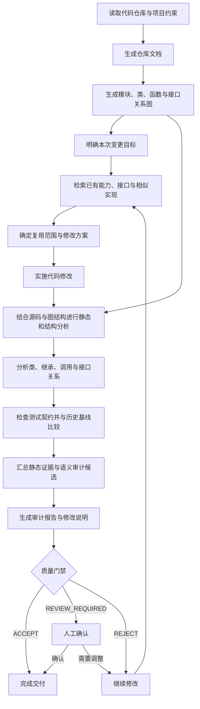

# Repository Quality Guard

[English](README.md) | 简体中文

Repository Quality Guard（RQG）是一套面向 AI 辅助开发和长期代码维护的**仓库级质量工程流程**。

它围绕完整代码仓库建立结构化文档和代码关系图，检索已有能力与接口，结合源码、模块关系、类关系、继承关系、调用关系和测试契约进行分析，并把当前修改与历史基线进行比较。需要上下文判断的问题进入语义审计，最终形成统一的质量门禁、审计报告和修改说明。

RQG 将“理解现有系统、复用已有能力、实施修改、分析结构影响、验证质量变化、确认交付结果”组织成一套可重复执行的开发闭环。

## 功能

- **仓库文档生成**：整理模块、类、函数、接口和重要代码实体，为后续检索和分析建立稳定上下文。
- **代码关系图**：建立模块依赖、类与继承、函数调用、接口实现以及跨文件引用关系。
- **已有能力检索**：在新增功能前检索相似实现、已有接口、公共能力和可能的代码 owner，辅助复用既有设计。
- **静态与结构分析**：结合源码与关系图分析控制流、接口边界、复杂度、fallback、动态执行、重复结构和仓库布局。
- **类与接口契约分析**：检查继承关系、override、方法签名、接口实现和跨模块契约。
- **测试契约分析**：检查测试与生产代码的对应关系、实现耦合和测试基线变化。
- **历史基线与增量审计**：区分历史债务、当前新增问题、既有问题恶化以及绝对阻断项。
- **语义审计**：将需要理解代码意图和项目上下文的问题交给显式语义裁决，并保存可回溯证据。
- **项目 Profile**：允许不同仓库定义自己的规则等级、豁免路径、结构契约和扩展检查。
- **统一质量门禁**：以 `ACCEPT`、`REVIEW_REQUIRED`、`REJECT` 汇总最终状态。

## 语言支持

RQG 当前为 **Python** 提供最完整的 AST、类关系、接口和源码级分析能力，同时覆盖 **JavaScript、TypeScript、HTML、CSS、C/C++** 的静态检查与仓库级分析。

Git 历史、目录结构、项目 Profile、文档与配置、代码关系图、基线比较、语义审计和质量门禁等仓库级能力可以作用于混合语言项目。不同语言的源码级分析深度取决于当前解析器和规则支持范围。

## 开发流程



这套流程让代码修改始终建立在仓库结构、已有能力和历史基线之上，并在交付前重新验证修改对整体设计产生的影响。

## 安装

RQG 采用标准 Skill 目录结构，可以直接作为 Agent Skill 安装，也可以作为普通 Git 仓库维护。

使用标准 Skill CLI：

```bash
npx skills add shijunfeng00/repository-quality-guard
```

或者直接克隆仓库：

```bash
git clone https://github.com/shijunfeng00/repository-quality-guard.git
```

完整发行包可以同时携带 Git 历史和离线运行依赖，适合需要完整开发环境或无法直接访问公共软件源的场景。

## 产物

RQG 在开发和审计过程中形成以下主要产物：

- **仓库文档**：记录重要模块、接口、公共能力和代码结构。
- **代码关系图**：描述模块、类、函数、接口以及它们之间的关系。
- **审计报告**：汇总静态规则、结构分析、基线变化、语义候选和质量门禁结果。
- **修改说明**：记录本次变更、验证结果、语义裁决以及仍需确认的事项。
- **项目 Profile**：保存项目自身的质量策略和架构约束。
- **质量门禁结果**：以 `ACCEPT`、`REVIEW_REQUIRED` 或 `REJECT` 表示当前状态是否可以进入下一阶段。
