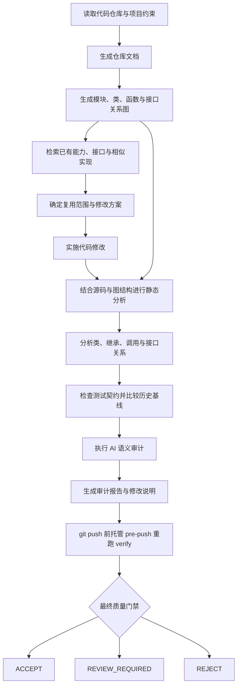
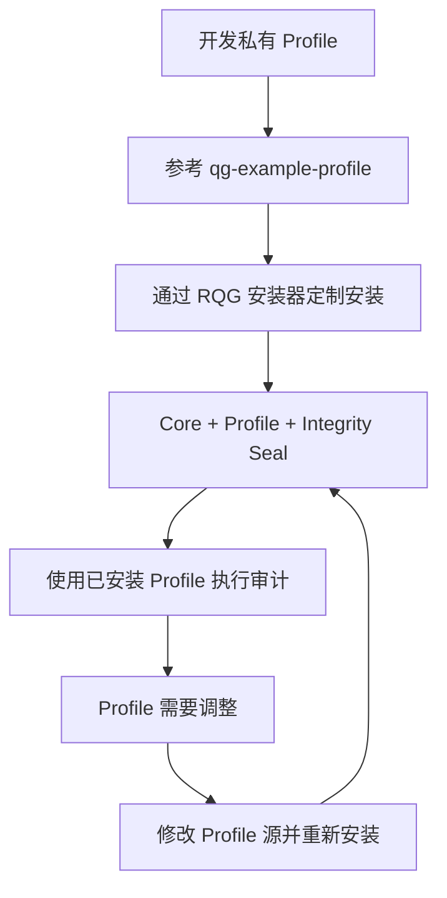

# Repository Quality Guard

[English](README.md) | 简体中文

Repository Quality Guard（RQG）是一套面向 AI 辅助开发和长期代码维护的**仓库级质量工程流程**。

RQG 为完整代码仓库生成结构化文档和代码关系图，检索已有能力与接口，结合源码、模块关系、类关系、继承关系、调用关系和测试契约进行静态与结构分析，并把当前修改与历史基线进行比较。需要理解设计意图和项目上下文的问题会进入 AI 语义审计，最终形成审计报告、修改说明和统一质量门禁。

RQG 将“理解现有系统、检索并复用已有能力、实施修改、分析结构影响、验证质量变化、形成可审计结论”组织成一套可重复执行的开发闭环。

## 功能

- **仓库文档生成**：整理模块、类、函数、接口和重要代码实体，为检索和审计建立稳定上下文。
- **代码关系图**：建立模块依赖、类与继承、函数调用、接口实现以及跨文件引用关系。
- **已有能力检索**：在新增功能前检索相似实现、已有接口和公共能力，辅助复用既有设计。
- **静态与结构分析**：结合源码和图结构分析控制流、接口边界、复杂度、fallback、动态执行、重复结构和仓库布局。
- **类与接口契约分析**：检查继承关系、override、方法签名、接口实现和跨模块契约。
- **测试契约分析**：检查测试与生产代码的对应关系、实现耦合、稳定行为覆盖和测试基线变化。
- **历史基线与增量审计**：区分历史债务、当前新增问题、既有问题恶化以及绝对阻断项。
- **AI 语义审计**：把静态规则无法独立决定的问题连同证据交给 AI，按照固定审判问题检查需求必要性、既有能力复用、职责所有权、接口同步、隐藏 fallback、测试弱化、生命周期约束以及未经授权的语义启发式等问题。
- **项目 Profile**：允许项目定义规则等级、规则关闭、路径策略和项目特有静态分析扩展。
- **统一质量门禁**：以 `ACCEPT`、`REVIEW_REQUIRED`、`REJECT` 汇总最终审计结论。
- **Git 推送门禁**：托管 `pre-push` hook 在每次 `git push` 前重新执行只读 `verify`；`REJECT`、报告无效或运行失败会阻断 push，`REVIEW_REQUIRED` 保留人工复核语义但不会被擅自升级为 `ACCEPT`。

### AI 语义审计如何工作

RQG 的静态规则负责提供可复现事实，AI 语义审计负责回答需要理解代码意图的问题。审计报告会把候选问题、相关代码关系和证据组织成固定问题，例如：

- 这次修改是否服务于明确的可观察需求；
- 新增接口前是否已经检索并复用仓库中的既有能力；
- 新增职责是否位于唯一正确的 owner；
- 参数、返回结构、协议或公共接口变化是否同步所有真实消费方；
- fallback、动态属性或兼容路径是否隐藏了契约问题；
- 测试是否验证稳定行为，而不是绑定当前实现形状；
- 缓存、事务、并发、锁和资源生命周期是否保持正确顺序；
- 是否用正则、关键词、阈值或其他启发式逻辑替代了本应由明确协议、领域算法或语义模型负责的判断。

这些问题让 AI 基于真实代码与结构证据完成语义裁决，并把依据写入修改报告，供后续 Agent 和开发者复核。

## 语言支持

RQG 当前为 **Python** 提供最完整的 AST、类关系、接口和源码级分析能力，同时覆盖 **JavaScript、TypeScript、HTML、CSS、C/C++** 的静态检查与仓库级分析。

Git 历史、目录结构、项目 Profile、文档与配置、代码关系图、基线比较、语义审计和质量门禁等仓库级能力可以作用于混合语言项目。不同语言的源码级分析深度取决于当前解析器和规则支持范围。

## 开发流程



代码修改从仓库结构和已有能力出发，并在交付前重新检查结构影响、接口契约、测试契约、历史质量变化和语义风险。fresh clone 或开发任务开始时，Agent 还必须确认托管 `pre-push` 已安装；Git hook 本身不会随仓库提交自动复制到新的 clone。

```bash
python .agents/skills/repository-quality-guard/scripts/git_hook_install.py .
```

已有非托管 `pre-push` 时安装器会明确报冲突并保持原文件不覆盖。Agent 不得使用 `git push --no-verify` 绕过质量门禁。托管 hook 会在每次 push 前重新执行 `verify`：`ACCEPT` 与 `REVIEW_REQUIRED` 可以继续，`REJECT`、报告契约不完整或验证运行失败会阻断 push。

## 审计结果

RQG 的最终质量门禁只有三种正式结果：

| 结果 | 含义 |
| --- | --- |
| `ACCEPT` | 当前修改满足自动审计和语义审计要求，可以进入下一阶段。 |
| `REVIEW_REQUIRED` | 审计已经识别出需要人确认其可接受性的变动，例如公共接口变化、兼容性变化或重要架构边界调整。Agent 应把事实、影响和证据保留在修改报告中，由人决定是否接受这类变更。 |
| `REJECT` | 当前修改命中明确的阻断条件，需要继续修改后重新审计。 |

`修改说明.md` 同时面向 Agent 和开发者：Agent 用它完成语义裁决、验证与后续修正；当结果为 `REVIEW_REQUIRED` 时，开发者可以直接查看同一份报告中的变更事实、接口差异、影响范围和审计证据，决定是否接受该修改。

## 安装与 Profile 定制

RQG 提供两种使用方式：通用安装适用于采用默认 Generic 策略的项目；定制安装用于需要项目私有 Profile 的团队和仓库。

### 通用安装

使用标准 Skill CLI 安装公开版本：

```bash
npx skills add shijunfeng00/repository-quality-guard
```

这种方式安装 RQG Core，并使用通用质量策略。它适合没有项目特有规则、路径策略或静态分析扩展的仓库。安装 Skill 后，在目标 Git 仓库中确认托管推送门禁：

```bash
python .agents/skills/repository-quality-guard/scripts/git_hook_install.py .
```

这个步骤需要在每个 fresh clone 中执行一次；如果仓库已经有非托管 `pre-push`，RQG 不会覆盖它。

### 开发自己的 Profile

公开仓库中的 [`profiles/qg-example-profile`](profiles/qg-example-profile) 是一个可执行参考示例。建议复制到项目自己的私有 Profile 目录后改名和调整内容。

一个 Profile 可以包含：

```text
my-project-profile/
├── profile.json
└── extension.py        # 可选
```

`profile.json` 用于声明规则等级、规则关闭、非阻断路径、测试基线策略以及 extension 使用的配置。只需要调整等级、忽略规则或路径策略时，使用 JSON 即可。

示例：

```json
{
  "schema": "repository-quality-guard/profile-v1",
  "name": "my-project-profile",
  "entrypoint": "extension.py",
  "rules": {
    "levels": {
      "QG203": "BLOCKER",
      "QG205": "SEMANTIC"
    },
    "disable": ["QG187"]
  },
  "nonblocking_paths": [
    "tests/**",
    "tools/tracing.py"
  ]
}
```

这里分别展示了规则升级、语义审计级别、项目级规则关闭和路径策略。

`extension.py` 是代码级插件接口，用于声明式 JSON 无法表达的项目特有静态分析。例如公开示例注册了状态映射稳定性契约和模型适配器 callable 契约，使 RQG 能在通用规则之外检查项目自己的类型、接口和结构约束。extension 也可以只生成语义审计候选，由 Profile 中的规则等级决定其最终门禁语义。

### 定制安装

Profile 开发完成后，使用 RQG 自己的安装器把 Core 和指定 Profile 一起安装到目标仓库：

```bash
python runtime/deploy.py \
  /path/to/repository-quality-guard \
  /path/to/project/.agents/skills/repository-quality-guard \
  --profile /path/to/my-project-profile
```

安装器会复制选定 Profile、写入安装策略并重新生成完整性 seal。安装后的 Profile 可以直接作为默认策略使用，也可以按安装时授权的名称显式选择：

```bash
python .agents/skills/repository-quality-guard/scripts/quality_guard.py \
  audit . --profile my-project-profile
```

安装完成后的 `.agents/skills/repository-quality-guard` 属于受保护的审计基础设施。直接修改 Core、已安装 Profile、manifest 或其他受保护内容会触发 QG990 完整性拒绝。Profile 需要更新、替换或新增时，修改 Profile 源并重新运行定制安装流程，由安装器生成新的合法安装状态。定制安装完成后同样需要在目标仓库确认托管 `pre-push`，使每次 push 都重新执行最终 `verify`。



## 产物

RQG 在开发和审计过程中形成以下主要产物：

- **仓库文档**：记录重要模块、接口、公共能力和代码结构。
- **代码关系图**：描述模块、类、函数、接口以及它们之间的关系。
- **审计报告**：汇总静态规则、结构分析、基线变化、语义审计证据和质量门禁结果。
- **修改说明**：记录本次变更、接口差异、验证结果、语义裁决和需要确认的修改影响。
- **项目 Profile**：保存项目自己的质量策略和静态分析扩展。
- **质量门禁结果**：以 `ACCEPT`、`REVIEW_REQUIRED` 或 `REJECT` 表示当前修改的最终审计状态。
